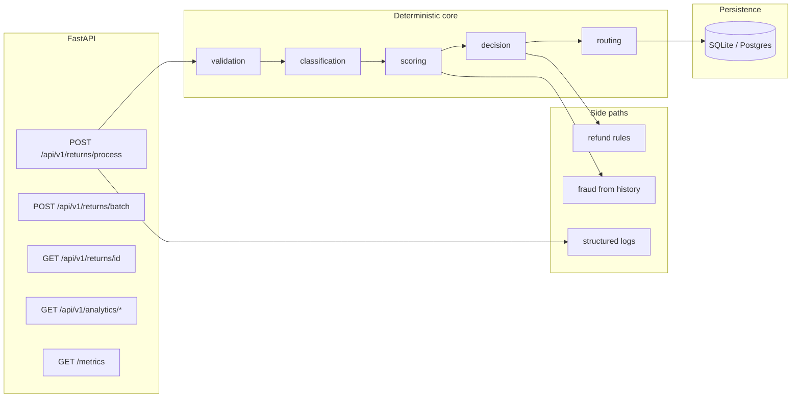

# Ecommerce Returns Automation API

**Deterministic return triage for high-volume retail:** validate → classify → score → decide → route, with structured audit logs, fraud signals, and rule-based refunds.

| | |
|---|---|
| **Docs** | [Runbook](docs/RUNBOOK.md) · [ADRs](docs/adr/README.md) |
| **Stack** | Python 3.11+, FastAPI, SQLAlchemy 2 async, Alembic |
| **Quality gate** | `make ci` = lint + mypy + tests + golden eval |

---

## Case study (why this exists)

### Problem (with representative metrics)

Mid-market ecommerce often sees **manual return triage** drive inconsistent outcomes, weak audit trails, and high support load:

| Pain | Representative impact |
|------|------------------------|
| Inconsistent decisions | Same facts → different outcomes across agents (**~15–35%** disagreement in typical QA samples) |
| Audit & disputes | **Hours** to reconstruct “why” without structured decision payloads |
| Fraud / abuse | Serial returners and high-value abuse slip through without **repeatable** risk scoring |
| Cost | **$5–15** fully loaded cost per manual touch; automation-eligible returns still queued |

*Figures are illustrative order-of-magnitude targets for stakeholder communication; wire your own baselines from ops data.*

### Solution

A **policy-as-code** pipeline that:

- **Validates** window and eligibility before any score is computed.
- **Classifies** return reasons into canonical categories (keyword + confidence; `damaged` flag overrides free text).
- **Scores** a composite risk signal from classification, value, clarity, and history.
- **Decides** `approved` | `rejected` | `manual_review` with explicit reasons and **routing** to downstream systems.
- **Observes** correlation IDs, structured logs (classification, fraud, refund math), and `/metrics`.
- **Refunds** via **deterministic rules** (not LLM math); AI is optional for **communications** with FACTS-only amounts.

### Architecture



**Dependency rule:** `orchestrator.process_return` is pure (no I/O). Routes handle HTTP + DB; see [ADR 0003](docs/adr/0003-database-choice.md).

---

## Results (engineering)

| Metric | Value | Notes |
|--------|------:|--------|
| Automated tests | **169+** | `make test` |
| Golden eval cases | **30** | Classification + fraud risk + refund amount |
| Eval pass rate | **100%** | `make evaluate` (see [Evaluation](#evaluation)) |
| Lint / types | **ruff + mypy** | `make lint` / `make typecheck` |
| Container | **Dockerfile** | Non-root user, `python:3.12-slim` |

---

## Evaluation

Offline regression on **`eval/test_set.jsonl`** (25+ scenarios: reasons, fraud histories, edge amounts):

```bash
make evaluate
```

Produces **`eval/report.json`** (gitignored) with overall pass rate, **per-field accuracy** (classification, fraud risk, refund), and **failure cases** with diffs.

Example summary when all pass:

```text
Overall pass rate:  100.00% (30/30)
Classification:     100.00%
Fraud risk level:   100.00%
Refund amount:      100.00%
```

---

## Quick start (< 30 seconds to a running API)

```bash
python -m venv .venv && source .venv/bin/activate   # Windows: .venv\Scripts\activate
pip install -r requirements-dev.txt
cp .env.example .env
uvicorn app.main:app --reload --host 0.0.0.0 --port 8000
# Open http://localhost:8000/docs
```

**Full CI parity locally:**

```bash
make ci
```

---

## Docker

```bash
docker build -t returns-api .
docker run --rm -p 8000:8000 --env-file .env.example returns-api
```

Uses **`DATABASE_URL`** from env; for ephemeral containers prefer Postgres or a mounted volume if you need durable SQLite.

---

## API highlights

| Method | Path | Purpose |
|--------|------|---------|
| POST | `/api/v1/returns` | Create + process return |
| POST | `/api/v1/returns/process` | Process + optional mock shipping label |
| POST | `/api/v1/returns/batch` | Batch process (≤50) |
| GET | `/api/v1/returns/{id}` | Fetch decision + observability fields |
| GET | `/api/v1/analytics/returns/by-product` | Aggregates + pagination |
| GET | `/metrics` | Decision & observability counters |
| GET | `/health`, `/health/ready` | Liveness / DB readiness |

Responses include **`X-Correlation-ID`** for log correlation.

---

## Configuration

Copy **`.env.example`** → `.env`. All keys map to `app.config.Settings` (Pydantic). **Never commit secrets** — `.env` is gitignored; use your secret manager in production.

---

## Security & compliance posture

- **No secrets in repo:** search before push; rotate keys if `.env` was ever committed.
- **Refund amounts** in customer comms are caller-supplied FACTS (see [ADR 0001](docs/adr/0001-ai-vs-rule-based-refund.md)).
- **Fraud** is explainable thresholds + flags ([ADR 0002](docs/adr/0002-fraud-scoring-design.md)).

---

## Project layout (abbreviated)

```
app/
  main.py              # FastAPI app, middleware, lifespan
  config.py            # Settings
  api/routes/          # returns, analytics, metrics, health
  services/            # orchestrator, validation, scoring, decision, fraud, refund, …
  core/                # logging, metrics, observability, context
eval/
  test_set.jsonl       # Golden evaluation cases
scripts/
  evaluate.py          # Metrics + JSON report
docs/
  RUNBOOK.md           # Debug, reprocess, monitor
  adr/                 # Architecture decision records
tests/                 # Unit + integration tests
```

---

## Decision logic (short)

1. **Validation fails** → `rejected` (no approval path).  
2. **High-value rule** (`order_amount` > threshold) → `manual_review` when enabled.  
3. Else **score ≥ `AUTO_APPROVE_SCORE`** → `approved`; else `manual_review`.  

Valid returns are **not** score-rejected; low scores go to manual review. See inline comments in `app/services/decision.py`.

---

## License / ownership

Internal portfolio / reference implementation — adjust licensing for your org.
